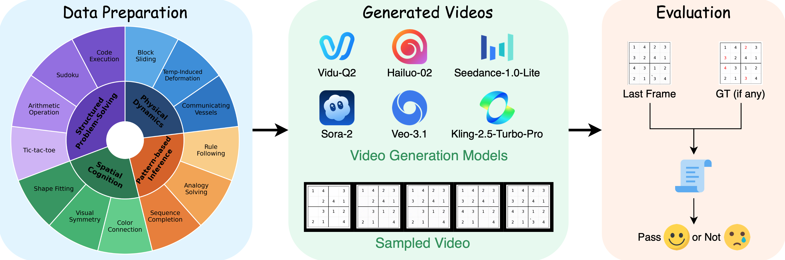

# V-ReasonBench

A lightweight and comprehensive evaluation suite for video reasoning tasks across multiple domains including structured problem-solving, spatial cognition, pattern-based inference, and physical dynamics.

<p align="center">
  
</p>

## 📋 TODOs

- [x] Release paper
- [ ] Release dataset and data generation code
- [ ] Release full code

## 🚀 Quick Start

### 1. Prerequisites

**Python Dependencies:**
```
pip install -r requirements.txt
```

**Download SAM 2:**
```bash
mkdir -p checkpoints
wget https://dl.fbaipublicfiles.com/segment_anything_2/092824/sam2.1_hiera_large.pt -O checkpoints/sam2.1_hiera_large.pt
```

### 2. API Configuration (Required)

**⚠️ Important**: Set environment variables before running evaluations:

```bash
export VLM_API_KEY="your_api_key_here"
export VLM_API_URL="your_api_url_here"
export VLM_MODEL="gemini-2.5-pro"  # Optional, default value
```

**Tasks requiring VLM API**: code, math, shape_fit, sudoku, temperature, color_connect

### 3. Run Evaluation

```bash
python evaluate.py --task <task_name>
```

**Examples:**
```bash
# Single task
python evaluate.py --task visual_symmetry

# Multiple tasks
python evaluate.py --task math code sudoku
```

## 📁 Dataset Structure

All tasks follow a standardized directory layout:

```
VReason-Bench/
  evaluations/
    <TaskName>/
      GT/              # Ground truth (images/CSVs)
      inputs/          # Initial state inputs
      video_outputs/   # Your generated videos to evaluate
      predictions/     # Auto-generated: extracted frames/results
      eval_results/    # Auto-generated: JSON evaluation results
```

## 📊 Output Format

Each task generates a unified JSON output at `evaluations/<TaskName>/eval_results/<task_name>_eval.json`:

```json
{
  "model_summary": [
    {
      "model": "model_name",
      "mean_score": 0.85,
      "pass_at_k": 0.92,
      "count": 50,
      "num_gt": 10
    }
  ],
  "aggregate": {
    "num_videos": 500,
    "num_gt": 10,
    "num_models": 5,
    "mean_score": 0.75,
    "pass_at_k": 0.82,
    "threshold": 0.7,
    "task_metrics": {...}
  },
  "results": {
    "/path/to/video.mp4": {
      "score": 0.85,
      "gt_index": "01",
      "model": "model_name",
      "passed": true
    }
  }
}
```

**Key Metrics:**
- **`pass_at_k`**: Probability of success in k attempts (calculated per model-GT pair, then averaged)
- **`mean_score`**: Average score across all predictions
- **`task_metrics`**: Task-specific metrics (accuracy, IoU, Delta-E, etc.)

## 🎯 Supported Tasks

### Structured Problem-Solving

| Task | Description | GT Format | Key Metrics |
|------|-------------|-----------|-------------|
| **arithmetic operation** | Mathematical expression solving | `GT/<level>/<idx>.csv` | Problem preservation + answer accuracy |
| **code execution** | Code execution and output | `GT/<difficulty>/<idx>.csv` | Problem preservation + execution correctness |
| **sudoku** | Sudoku puzzle solving (4×4, 9×9) | `GT/<idx>.csv` | Cell-by-cell grid accuracy |
| **tic_tac_toe** | Game state progression | `GT/<idx>.png` | Grid cell comparison |

### Spatial Cognition

| Task | Description | GT Format | Key Metrics |
|------|-------------|-----------|-------------|
| **shape fitting** | Shape fitting puzzle solving | Inputs only | VLM-based hole filling accuracy |
| **visual symmetry** | Symmetry completion | `GT/<type>/single/<idx>.png` | Delta-E color accuracy |
| **color_connect** | Color matching and connection | `GT/<idx>.png` | VLM-based connection accuracy |

### Pattern-based Inference

| Task | Description | GT Format | Key Metrics |
|------|-------------|-----------|-------------|
| **sequence completion** | Sequence pattern completion | `GT/<idx>.png` + masks | Shape/background accuracy |
| **analogy solving** | Visual transformation understanding | `GT/<concept>/<idx>.png` | IoU with SAM segmentation |
| **rule following** | Pattern completion following rules | `GT/<idx>.png` | Cell-by-cell grid accuracy |

### Physical Dynamics

| Task | Description | GT Format | Key Metrics |
|------|-------------|-----------|-------------|
| **temperature** | Ice melting under different conditions | `inputs/<idx>.png` | VLM physical reasoning score |
| **lever balance** | Lever balance physics | `GT/<idx>.csv`| Mask-specific pixel accuracy |
| **communicating vessels** | Fluid dynamics | `GT/<idx>.csv` | Mask-specific pixel accuracy |
| **block_slide** | Block sliding puzzle | `GT/<idx>_gt.png` + masks | Shape/background accuracy |

## 📈 Evaluation Metrics

### Pass@k Calculation

For each model-GT pair:
1. Count predictions: k (should be 5)
2. Count passed: predictions with `score >= threshold`
3. Model-level pass@k = average across all GTs

## 📝 Citation

```bibtex
@misc{luo2025vreasonbenchunifiedreasoningbenchmark,
      title={V-ReasonBench: Toward Unified Reasoning Benchmark Suite for Video Generation Models}, 
      author={Yang Luo and Xuanlei Zhao and Baijiong Lin and Lingting Zhu and Liyao Tang and Yuqi Liu and Ying-Cong Chen and Shengju Qian and Xin Wang and Yang You},
      year={2025},
      eprint={2511.16668},
      archivePrefix={arXiv},
      primaryClass={cs.CV},
      url={https://arxiv.org/abs/2511.16668}, 
}
```
